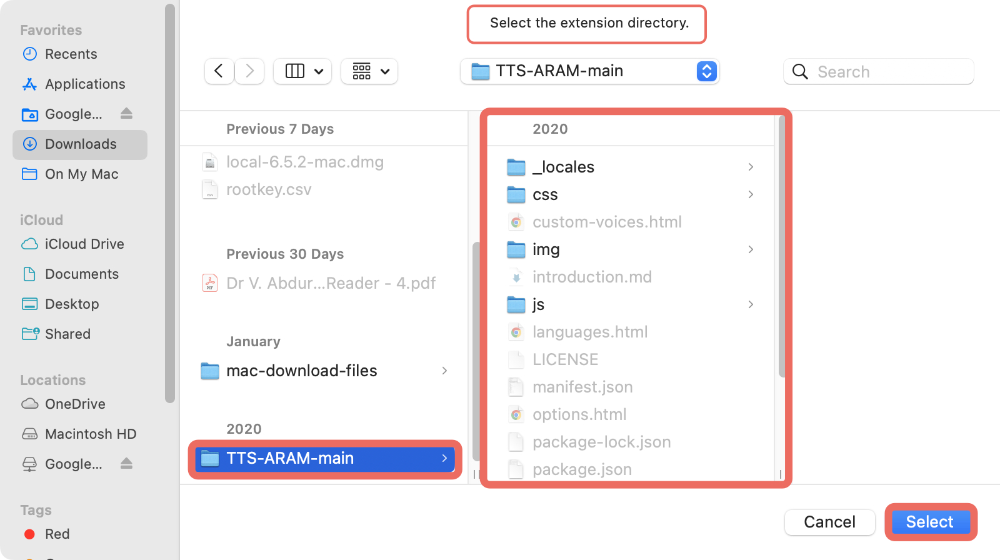

<div align="center">
	
	<br>
	<br>
	A <b>Text to Speech Voice Reader</b> extension for your browser!
</div>

<div align="center">
	<a href="https://chrome.google.com/webstore/detail/read-aloud-a-text-to-spee/hdhinadidafjejdhmfkjgnolgimiaplp">Chrome Web Store</a> | <a href="https://addons.mozilla.org/en-US/firefox/addon/read-aloud/">Firefox Addon</a> | <a href="https://blog.readaloud.app/">Blog</a> | <a href="https://readaloud.app/">Website</a>
</div>

<br>

<div align="center">
    <br> github stats:
    
    
    
    
    
</div>
<hr/>
## Overview
Read Aloud is a Chrome and Firefox extension that uses text-to-speech technology to convert webpage text to audio. It works on a variety of websites, including news sites, blogs, fan fiction, publications, textbooks, school and class websites, online universities and course materials.

Read Aloud is aimed at users who prefer to listen to content instead of reading, people with dyslexia or other learning disabilities, children learning to read, or simply to provide users with alternative way to consume web content.

Read Aloud allows you to select from a variety of text-to-speech voices, including those provided natively by the browser, as well as by text-to-speech cloud service providers such as Google Wavenet, Amazon Polly, IBM Watson, and Microsoft. Some of the cloud-based voices may require additional in-app purchase to enable.

## Basic Usage

### Extension Button


### Right Click Menu


## Advanced Usage

### Shortcuts

```yaml
ALT-P           : Play/Pause
ALT-O           : Stop
ALT-Comma       : Rewind
ALT-Period      : Forward
```

### Customization

You can change the voice, reading speed, pitch, or enable text highlighting:

1. Click the Read Aloud icon on the Extensions menu.
2. Stop any text that may be playing.
3. Click on the Gear icon in the Read Aloud context menu. (It may take a second or two for settings to appear)


## Installation
### Mac/Windows/Linux
To install on a Mac/Windows/Linux system, you need to download the extension:

Extension download: [Click here: ⬇](./instructions/Extension%20%7C%20TTS-ARAM.zip)

 This is your installation guide for Mac/Windows/Linux. <br><br>
 Step 1: Download the extension<br><br>
<br>or
<br><br>
Step 2: Unzip the .zip file<br><br>
Step 3: Go to your Chrome browser and click the elipsis ⋮<br><br>
<br><br>
Step 4: Go to More Tools => Extensions<br><br>
<br><br>
Step 5: Turn on developer mode in the extensions page<br><br>

Step 6: Click the load unpacked button<br><br>

Step 7: Select the folder that the extension is located in<br><br>

Step 8: (not really a step) The extension is downloaded!<br><br>


### Firefox
You can get the latest version of Read Aloud Extension from the [Mozilla Add-ons website](https://addons.mozilla.org/en-US/firefox/addon/read-aloud/).

## Contribute

- Star this GitHub repo ⭐️
- Post about it on your social media (Twitter / Blogs / Facebook / Instagram etc).
- Create pull requests, submit bugs, suggest new features or documentation updates 🛠
	- To do so, go to [this page](https://github.com/aramb-dev/TTS-ARAM/issues) and click the [*New issue*](https://github.com/aramb-dev/TTS-ARAM/issues/new) button.

## Credits
Forked from [ken107/read-aloud][def]

[def]: https://github.com/ken107/read-aloud